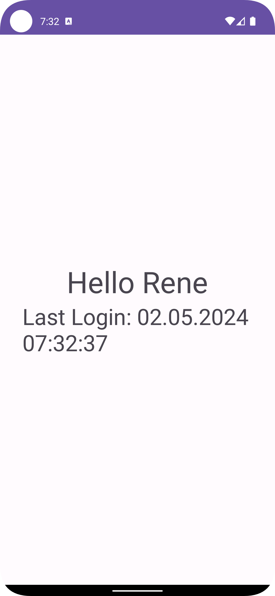

# App 3 - Login with Dashboard
Create a new Project (xml). Goal is to create a Login Screen that redirects to a Dashboard when successfully logged in:

- Match predefined credentials to successfully login
- Show error for Password / Email field if wrong 
  - Hide error if text is changed in password / email 
- Password field should "hide" input with circles
- Once Login is successful redirect to Dashboard 
- Ensure onbackpressed we don’t get redirected to login screen 
- Dashboard shows Username (passed by Login Screen)
- Dashboard shows Date and Time of Login 
- Ensure when rotating device everything works

