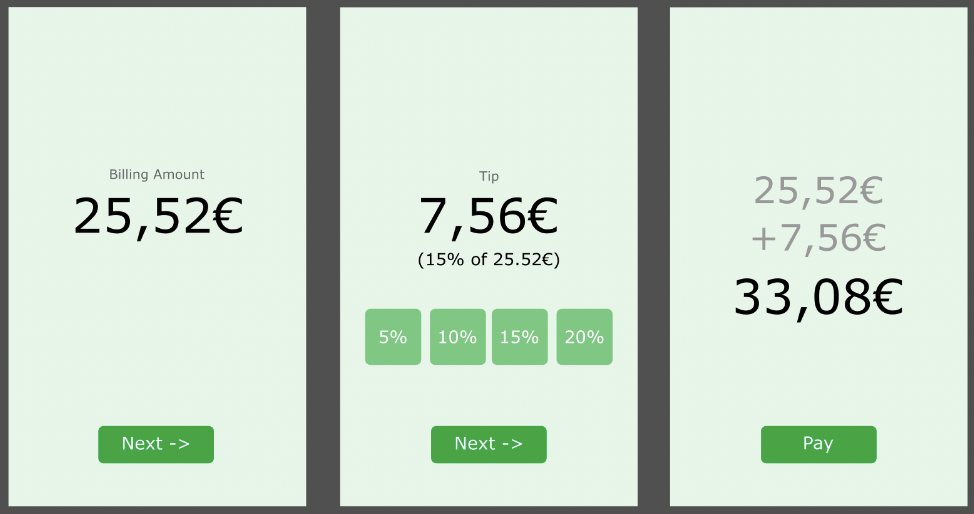

# Exercise 5 - Tip Calculator

- First screen enter total amount to pay
- Next leads to next screen
- Shows total amount and options to tip or option to enter specific value
- Below the tip amount show the tip percentage
- Clicking next will show the final screen
- Here display the first value of the billing value + the tip value and total value
- Click Pay and show a Toast that says “Successfully paid”
- If you are finished early beautify the design
- Dont forget to handle configuration changes!
- Note: Me and Google are your friends

  
Hint 🤫

Take a look at the following presentation again if you have troubles: https://docs.google.com/presentation/d/1s9Au5W7KABMAg2zjIYNIlV_jrnhTIiq1JwlEcZpP_v8/edit#slide=id.p

