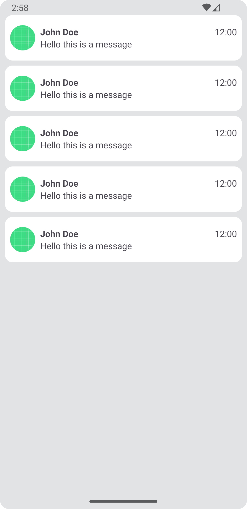

# Exercise 6 - Chat List
The goal of this exercise is to build a Chat List as shown in the Screenshot.
At this point in the course we have not yet learned RecyclerView. Create a CustomView for the Chat and use it in XML repeatedly.

Build the ChatView using RelativeLayout :)

