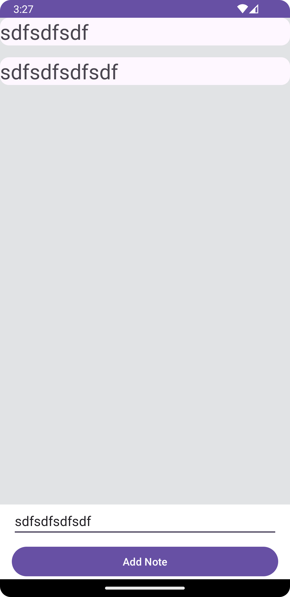
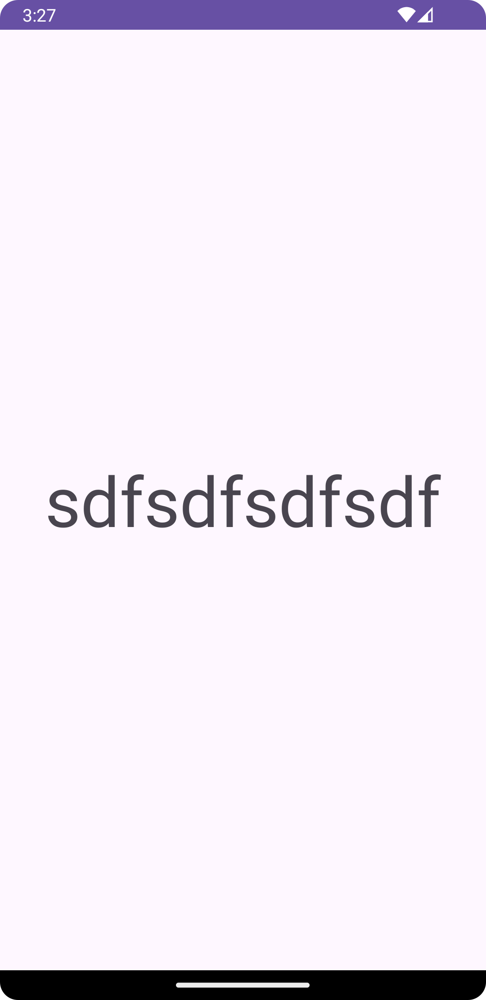

# Exercise 7 - Simple Notetaking
Build an App that looks similar to the one in the Screenshot.

You will need 2 Activities:
- One will have a RecyclerView and the ability to add elements to it
- The second one will receive the notes text when its clicked and show it

Don't forget to keep the data of the RecyclerView stored in a ViewModel so on configuration changes data is not lost!

