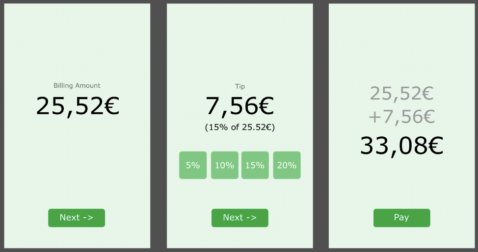

## Exercises for the Basic Android Course
This repo should include all exercises we've gone through during the Android Course.  
You can re-do them / finish them at home so you get a better understanding for Android. 

Folders prefixed with *App_* are small Apps we've built together in the lessons.

## Useful resources for Beginners
- [A great blog explaining Kotlin](https://typealias.com/start/)
- [Dribble for App Designs - Pick any design and try to build just the UI to practice](https://dribbble.com/search/app)
- [Official Android Training Courses](https://developer.android.com/get-started/overview)
- [Google Android Codelabs](https://developer.android.com/get-started/codelabs)
- [Official Android Developer Blog](https://android-developers.googleblog.com/)

## Task:

- First screen enter total amount to pay
- Next leads to next screen
- Shows total amount and options to tip or option to enter specific value
- Below the tip amount show the tip percentage
- Clicking next will show the final screen
- Here display the first value of the billing value + the tip value and total value
- Click Pay and show a Toast that says “Successfully paid”
- If you are finished early beautify the design
- Dont forget to handle configuration changes!
- Note: Me and Google are your friends
